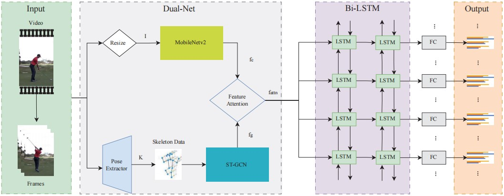
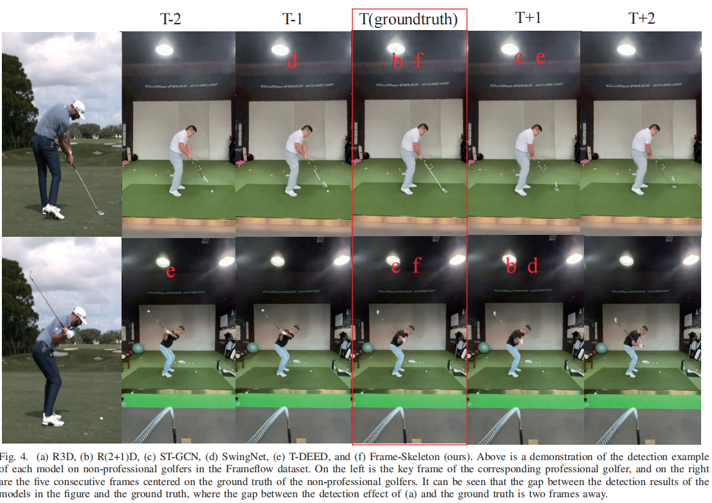

# Frame-Skeleton
IJCNN2025 paper's origin model:
《Frame-Skeleton: A Dual-Stream Network for Action Events Sequence Spotting》



The network architecture of Frame-Skeleton, a two-stream network for action event spotting. Frame-Skeleton splits the video into frames, transforms it into a resized RGB image sequence I and a bone joint sequence K obtained by Pose Extractor, and generates the feature vectors fc and fg by MobileNetV2 and ST-GCN respectively. After passing through a channel attention module to fuse the features, they are processed by a bi-directional LSTM, followed by a fully connected layer with a softmax activation to compute the event probabilities.

The parameter count of the entire model is less than 8 million. While ensuring lightweight, it solves the overfitting problem of small datasets and has a good effect on the key frame detection of single-person movement

## Dependencies

To utilize this tool, ensure the installation of:
- Python 3.8 or later
- [PyTorch](https://pytorch.org/) (prefer with CUDA for GPU support)
- PyCharm or VScode is recommended. You can open the Folder as PyCharm or VScode project.
- Better for linux system and gpu.

## Installation Steps

1. Create a virtual environment for your anaconda or miniconda:
   ```
   conda create -n your_env_name python=3.9
   conda activate your_env_name
   ```
   Install the right pytorch version and able to use cuda.
   You can use "nvcc -V" to see your cuda version

2. Clone the repository:
    ```bash
    git clone https://github.com/Asadashino-o/Frame-Skeleton.git
    cd Frame-Skeleton
    ```
   
3. Install necessary Python packages:
    ```bash
    pip install -r requirements.txt
    ```
   ( If opencv can't work , try to use conda install: "conda install opencv -c conda-forge" )

4. Clone the Detectron repository:
    ```bash
    git clone https://github.com/facebookresearch/detectron2.git
    ```
   
## Getting Started
* Please firstly download the video dataset from website. For information on the public dataset GolfDB, please refer to [this link](https://arxiv.org/abs/1903.06528).
* You can get the npy files through (./Preprocess/generate_npy.py). Please see the model weights' details in the (./weights/readme.txt).
* The final dataset needs three items: videos(image info), npy files(skeleton info), txt file(label).
  
### Train
* Download the MobileNetV2 pretrained weights from this [repository](https://github.com/tonylins/pytorch-mobilenet-v2) and place 'mobilenet_v2.pth.tar' in the weights directory.

* Run train.py

### Evaluate
* Train your own model by following the steps above or download the pre-trained weights (please contact with author). If you download, please put it in the (./weights/) directory.

* Run eval.py

### Test your own video
* Follow steps above to download pre-trained weights.put them in the (./weights/) directory.
* Put the test video in (./data/) directory.

* Run test_video.py

### Special reminder
* There is a task to detect face-on or down-the-line keyframes of golf swing sequences, if you want to detect other individual sports, please refactor the code.
* Please distinct face-on or down-the-line for different detection.


